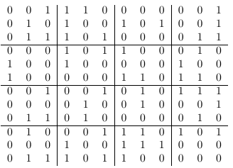
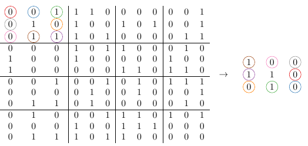
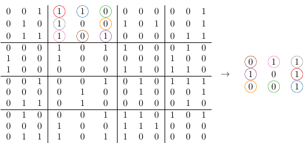
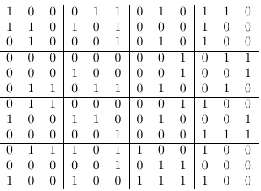

# Problema B - Encriptación Matricial

Tiempo: 1,0 s

En una instalación secreta, un grupo de especialistas en criptografía y
análisis de datos trabaja a contrarreloj en una misión de máxima importancia.
Su objetivo es desarrollar un sistema capaz de transmitir, sin errores y sin
revelar su significado, una serie de números decimales asociados a la
localización de objetos de gran valor. Un descuido en la transmisión podría
hacer que la información cayera en manos equivocadas, por lo que enviar los
datos originales directamente queda completamente descartado.

Para evitarlo, los especialistas han diseñado un método de encriptación que
transforma la información antes de su envío. Primero, los datos asociados a
la localización se organizan en una matriz de números decimales. Después,
aplicando un procedimiento cuidadosamente definido, la matriz se convierte en
un único vector de números decimales, listo para ser transmitido de forma más
segura y eficiente. Tu misión será reproducir exactamente ese proceso de
transformación y obtener el vector final siguiendo las reglas indicadas.

El procedimiento de cifrado se compone de tres fases principales:

1. **Conversión binaria**: Sea $A$ la matriz de entrada de tamaño $12 \times 3$
   cuyos elementos son números decimales. Cada elemento $a_{ij}$ se transforma
   en su representación binaria de 4 bits. Como resultado se obtiene una
   matriz binaria ($MB$) de tamaño $12 \times 12$ rellena de ceros y unos.

2. **Transformación por submatrices**: La matriz $MB$ se divide en 16
   submatrices disjuntas de tamaño $3 \times 3$. En cada submatriz se
   considera la *periferia*, formada por los ocho elementos que rodean al
   elemento central.

   Sea $N$ el número de unos presentes en dicha periferia. Entonces:
   - Si el elemento central es 0, la periferia se rota $N$ posiciones en
     dirección contraria a las agujas del reloj.
   - Si el elemento central es 1, la periferia se rota $N$ posiciones en la
     dirección de las agujas del reloj.

   Este procedimiento se aplica de forma independiente a cada una de las 16
   submatrices, obteniendo así una nueva matriz binaria $MB'$

3. **Conversión a formato decimal**: Finalmente, la matriz binaria resultante
   $MB'$ se transforma en un vector de 12 números decimales. Para ello, cada
   columna de $MB'$, interpretada como un número binario de 12 bits, se
   convierte a su representación decimal correspondiente.

## Entrada
La entrada consiste en una matriz de tamaño $12 \times 3$ cuyos elementos
$a_{ij}$ son números decimales tales que $0 \leq a_{ij} \leq 9$. La matriz se
proporciona mediante 12 líneas, cada una conteniendo 3 números decimales
separados por espacios.

## Salida
La salida será un vector de 12 números decimales separados por espacios.

## Entrada de ejemplo
```
3 8 1
5 2 9
7 4 3
1 6 2
9 0 4
8 3 6
2 5 7
0 9 1
6 8 2
4 7 5
1 3 8
7 6 0
```

## Salida de ejemplo
```
3089 1636 100 1173 2128 3662 5 2643 419 3629 2376 408
```

- La matriz de entrada se transforma en una binaria:



- En el caso de la submatriz $3 \times 3$ situada en la esquina superior
  izquierda de la matriz, la periferia contiene 3 unos y el elemento central
  es 1, por lo que la periferia se rota 3 posiciones hacia la derecha.



- En el caso de la segunda submatriz, la periferia contiene 5 unos y el
  elemento central es 0, por lo que la periferia se rota 5 posiciones hacia la
  izquierda.



- La matriz binaria resultante después de 16 iteraciones queda de la siguiente
  forma:



- Finalmente, la matriz binaria resultante se transforma en un conjunto de
  valores decimales agrupando los bits por columnas:

```
3089 1636 100 1173 2128 3662 5 2643 419 3629 2376 408
```
