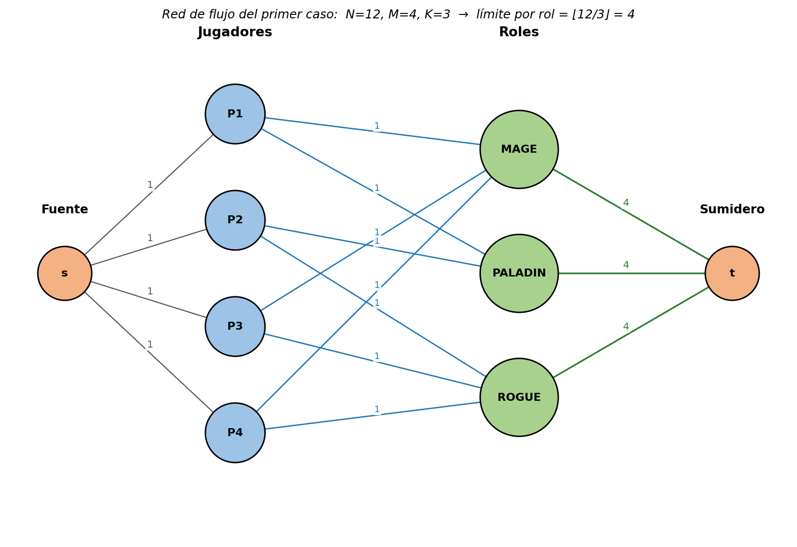
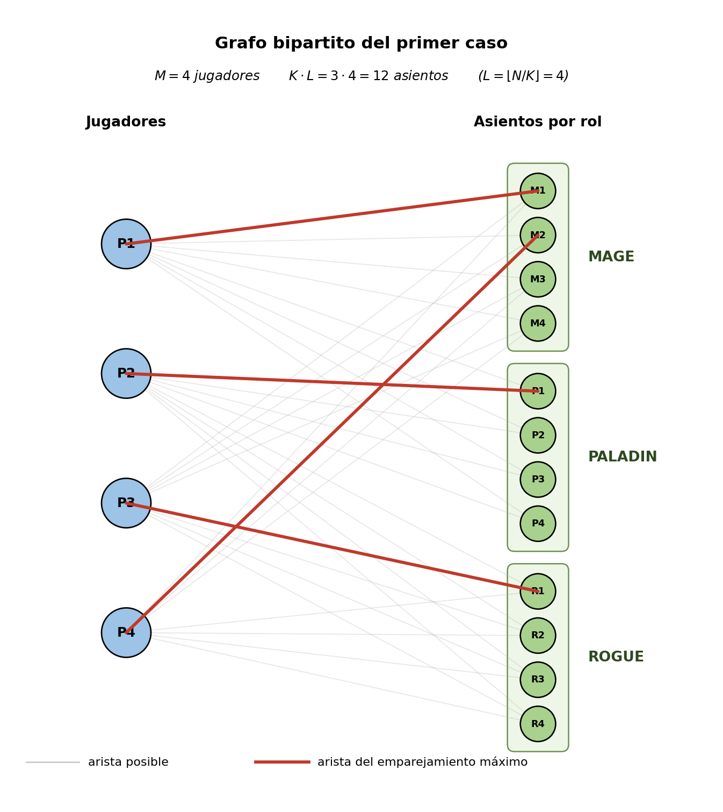

# Introducción a la solución

Cada jugador debe acabar asignado a exactamente uno de los dos roles que
domina, y cada rol $r$ admite como mucho $L = \lfloor N/K \rfloor$ jugadores.
La pregunta de si existe una asignación válida se corresponde de forma natural
con un problema de emparejamiento con capacidades en un grafo bipartito,
que admite dos modelados canónicos:

1. Como **flujo máximo** sobre una red con un nodo por jugador y un nodo por rol.
2. Como **emparejamiento bipartito clásico** (Hopcroft–Karp) sobre un grafo en
   el que cada rol se divide en $L$ "asientos" independientes.

Ambas alternativas dan la misma respuesta y son lo bastante rápidas para los
límites del problema ($M \le 100$, $K \le 20$, $N \le 200$).

# Alternativa 1: Flujo máximo

Construimos una red dirigida con:

- Una **fuente** $s$ y un **sumidero** $t$.
- Un nodo por cada jugador $j = 1, \dots, M$.
- Un nodo por cada rol $r = 1, \dots, K$.

Y las siguientes aristas, todas con capacidad entera:

| Arista | Capacidad | Significado |
| :----- | :-------: | :---------- |
| $s \rightarrow j$ para cada jugador | $1$ | Cada jugador se asigna a lo sumo una vez. |
| $j \rightarrow r$ si el jugador $j$ domina el rol $r$ | $1$ | El jugador toma un único puesto de los $L$ disponibles del rol $r$. |
| $r \rightarrow t$ para cada rol | $L$ | Un rol acepta como máximo $L$ jugadores. |

El flujo máximo de $s$ a $t$ es exactamente el número de jugadores que pueden
colocarse respetando las restricciones. La respuesta es `YES` si ese flujo
vale $M$ (todos los jugadores colocados), y `NO` en caso contrario.

Como cada jugador tiene exactamente dos roles, el grafo es siempre pequeño
(a lo sumo $M + K + 2 \le 122$ nodos y unas $3M + K$ aristas). Cualquier
algoritmo de flujo máximo estándar (Edmonds–Karp, Dinic, Ford–Fulkerson) es
más que suficiente.

## Ejemplo visual (primer caso)

Para el primer caso de prueba, $N = 12$, $M = 4$, $K = 3$, el límite por rol
es $L = \lfloor 12/3 \rfloor = 4$. La red construida es:

# Alternativa 2: Emparejamiento bipartito con Hopcroft–Karp

El problema también se puede ver como un emparejamiento bipartito puro (sin
capacidades) aplicando un truco: **duplicamos cada rol $r$ en $L$ "asientos"
independientes** $r_1, r_2, \dots, r_L$. Así, la capacidad $L$ del rol se
convierte en $L$ vértices distintos del lado derecho, cada uno con capacidad
$1$.

El grafo bipartito resultante es:

- **Lado izquierdo**: $M$ jugadores.
- **Lado derecho**: $K \cdot L = N$ asientos (los $L$ asientos del rol $r$ son
  $r_1, \dots, r_L$).
- **Aristas**: si el jugador $j$ domina los roles $a$ y $b$, añadimos las
  aristas $j \to a_i$ y $j \to b_i$ para todo $i = 1, \dots, L$.

Un **emparejamiento máximo** en este grafo se corresponde exactamente con una
asignación parcial válida de jugadores a asientos: ningún jugador ocupa dos
asientos (grado $\le 1$ en el lado izquierdo) y ningún asiento recibe dos
jugadores (grado $\le 1$ en el lado derecho, que equivale a respetar el cupo
$L$ de cada rol). La respuesta es `YES` si y sólo si el emparejamiento máximo
vale $M$ (todos los jugadores quedan emparejados).

Para encontrarlo se usa **Hopcroft–Karp**, que calcula el emparejamiento
máximo de un grafo bipartito con $V$ vértices y $E$ aristas en
$O(E \sqrt{V})$. Con los
límites del problema, $V = M + N \le 300$ y
$E \le 2 M L \le 2 \cdot 100 \cdot 200 = 40\,000$, lo que deja un margen
sobradamente cómodo.

## Ejemplo visual (primer caso)

Para el mismo primer caso, el grafo bipartito con $M = 4$ jugadores y
$K \cdot L = 12$ asientos queda así (en rojo se resalta un emparejamiento
máximo, que empareja los $4$ jugadores y por tanto da la respuesta `YES`):

# Soluciones

| Solución | Descripción | Verificado con el juez |
| :------: | :---------- | :--------------------: |
| [K_flujo.cpp](src/K_flujo.cpp) | Flujo máximo con Dinic | :white_check_mark: |
| [K_matching.cpp](src/K_matching.cpp) | Emparejamiento bipartito con Hopcroft–Karp (duplicando cada rol en $L$ asientos) | :white_check_mark: |
